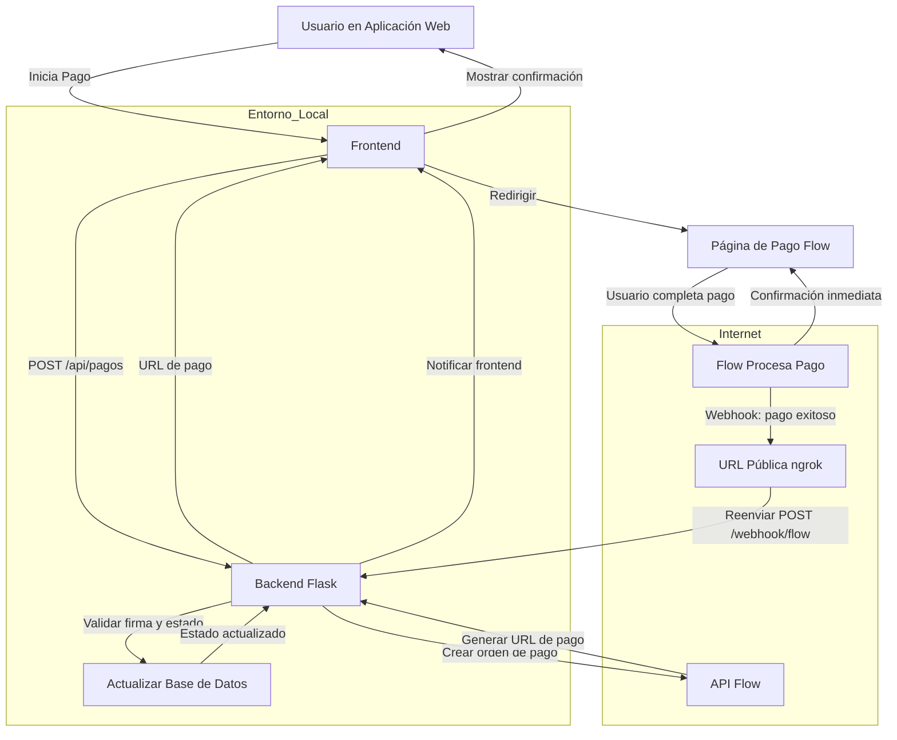

# Mis Tareas - Aplicación de Gestión de Tareas

Aplicación web responsive para gestionar tareas con persistencia en MySQL remoto.

## Características

- Crear, editar, eliminar y marcar tareas como completadas
- Interfaz responsive adaptada para móviles y escritorio
- Persistencia de datos en MySQL remoto (192.168.1.10)
- Contador de tareas pendientes y completadas
- Diseño moderno con gradientes y animaciones
- Frontend en HTML/JavaScript puro (sin necesidad de Node.js)

## Requisitos Previos

- Python 3 (incluido en macOS)
- pip3
- Servidor MySQL remoto accesible en 192.168.1.10

## Configuración de Base de Datos

La aplicación está configurada para conectarse a:
- **Host**: 192.168.1.10
- **Usuario**: cpadilla
- **Base de datos**: mis_tareas
- **Puerto**: 3306

## Instalación y Configuración

### 1. Configurar el Backend (Python/Flask)

```bash
cd backend
pip3 install -r requirements.txt
```

La tabla `tareas` se creará automáticamente en la base de datos MySQL si no existe.

### 2. Iniciar el Backend

```bash
python3 app.py
```

El backend estará disponible en `http://localhost:3001`

### 3. Abrir el Frontend

Simplemente abre el archivo `frontend/index.html` en tu navegador web:

```bash
open frontend/index.html
```

O puedes usar un servidor HTTP simple para servir los archivos estáticos:

```bash
cd frontend
python3 -m http.server 8000
```

La aplicación estará disponible en `http://localhost:8000`

## Uso

1. **Crear Tarea**: Ingresa un título y opcionalmente una descripción, luego haz clic en "Agregar Tarea"
2. **Marcar como Completada**: Haz clic en el checkbox junto a la tarea
3. **Editar Tarea**: Haz clic en el botón "Editar" para modificar el título y descripción
4. **Eliminar Tarea**: Haz clic en el botón "Eliminar" para borrar la tarea

## Estructura del Proyecto

```
mis-tareas/
├── backend/
│   ├── app.py                 # API Flask con MySQL
│   └── requirements.txt       # Dependencias del backend
└── frontend/
    ├── index.html             # Página principal
    ├── app.js                 # Lógica JavaScript
    └── styles.css             # Estilos responsive
```

## Flujo de Pago con Flow + ngrok + Webhooks

El siguiente diagrama ilustra el flujo completo de pago integrado con Flow, utilizando ngrok para recibir webhooks en entornos locales:



### Pasos del flujo

1. El usuario inicia el pago desde la aplicación web.
2. El frontend envía una solicitud al backend Flask para crear la orden de pago.
3. El backend comunica con la API de Flow y obtiene una URL de pago.
4. El usuario es redirigido a la página de pago de Flow.
5. Flow procesa el pago y notifica mediante un webhook.
6. En entornos locales, ngrok expone una URL pública que recibe el webhook de Flow.
7. ngrok reenvía la notificación al backend Flask en el puerto local.
8. El backend valida la firma y el estado del pago, y actualiza la base de datos.
9. El frontend refleja la confirmación del pago al usuario.

### Configuración del Webhook

1. Inicia ngrok apuntando al puerto del backend:
   ```bash
   ngrok http 3001
   ```
2. Copia la URL pública generada (por ejemplo, `https://abc123.ngrok.io`).
3. En el panel de Flow, configura la URL del webhook como:
   ```
   https://abc123.ngrok.io/webhook/flow
   ```
4. Asegúrate de que el backend valide la firma del webhook según la documentación de Flow.

## API Endpoints

- `GET /api/tareas` - Obtener todas las tareas
- `POST /api/tareas` - Crear una nueva tarea
- `PUT /api/tareas/:id` - Actualizar una tarea
- `DELETE /api/tareas/:id` - Eliminar una tarea

## Detener la Aplicación

Para detener los servicios:

```bash
# Detener backend (Ctrl+C en la terminal)
# Detener frontend (Ctrl+C en la terminal)
```

## Solución de Problemas

### El backend no responde
- Verifica que el puerto 3001 no esté en uso
- Revisa los logs del backend
- Asegúrate de que el servidor MySQL en 192.168.1.10 sea accesible
- Verifica que el usuario `cpadilla` tenga los permisos necesarios en MySQL

### Error de conexión a MySQL
- Verifica que el servidor MySQL esté corriendo en 192.168.1.10
- Asegúrate de que el firewall no bloquee el puerto 3306
- Verifica que el usuario y contraseña sean correctos
- Confirma que la base de datos `mis_tareas` existe en el servidor

### El frontend no se conecta al backend
- Asegúrate de que el backend esté corriendo en el puerto 3001
- Verifica que no haya bloqueo de CORS
- Revisa la consola del navegador para errores de red